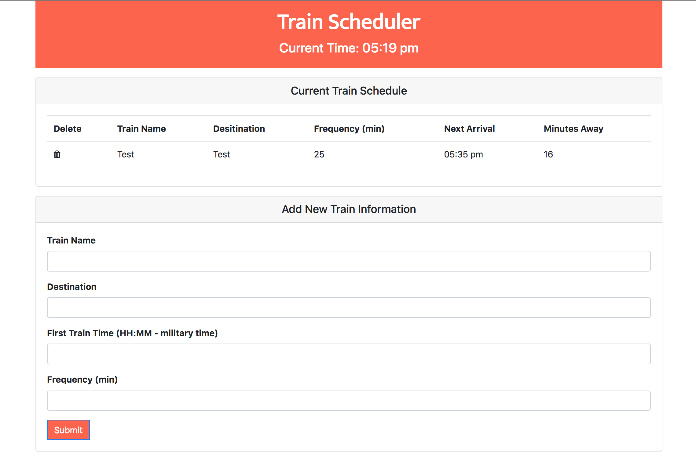

# Train Scheduler

### How it works:
To add a train, give it a name, a destination, the time that the first train will arrive for your route (use your imagination), and the frequency with which the train will arrive and the app will do the rest! You can also delete a train, if you'd like!

### [Try it out!](https://ragobash.github.io/trainscheduler/)

Technology:
HTML5 | CSS3 | JavaScript | jQuery
Bootstrap | Firebase